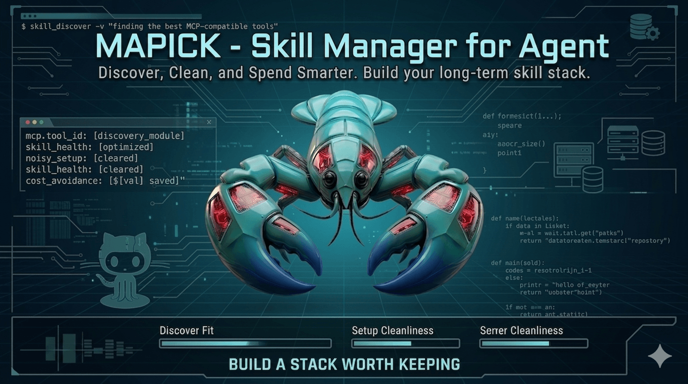
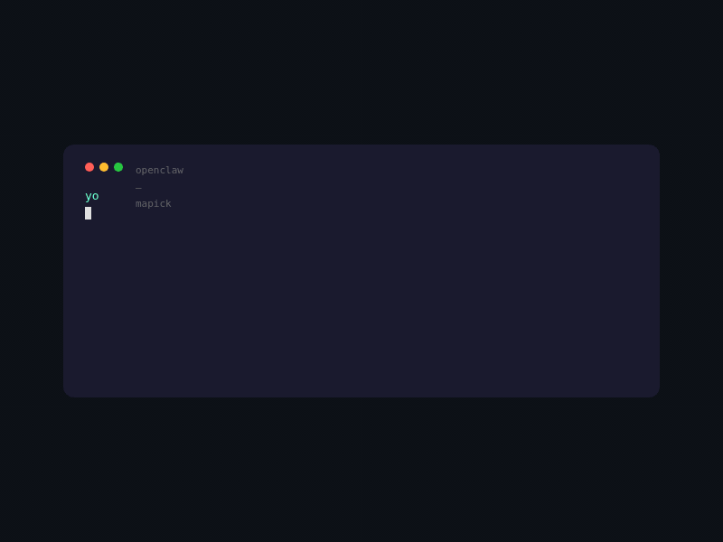
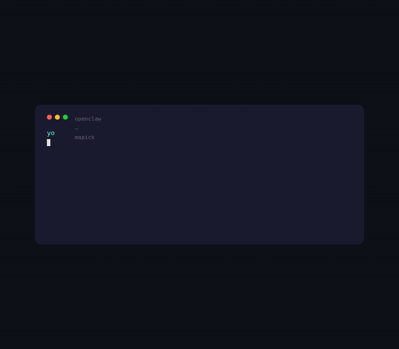

<p align="center">
  
</p>

<h1 align="center">🔍 Mapick</h1>

<p align="center">
  <strong>The Mapick Butler — Skill lifecycle management · smart recommendations · bundle suggestions</strong>
</p>

<p align="center">
  
  
  
</p>

<p align="center">
  <a href="https://mapick.ai">Website</a> &nbsp;|&nbsp;
  <a href="https://discord.gg/ju8rzvtm5">Discord</a> &nbsp;|&nbsp;
  <a href="#install">Install</a> &nbsp;|&nbsp;
  <a href="#commands">Commands</a> &nbsp;|&nbsp;
</p>

<!-- # 🔍 Mapick

**The AI skill manager for OpenClaw.** Protects your privacy, recommends what you need, cleans what you don't use, and blocks what's unsafe.

```
clawhub install mapick
``` -->

<!-- > No setup needed. Just talk to your agent after installing. -->

---

## The problem

ClawHub has 57,000+ skills. You followed a tutorial, installed 40 of them, and now:

- **Every skill you installed can see everything you do** — this isn't a bug, it's how OpenClaw works. Every skill runs inside your conversation context, legitimately reading your chat history, code snippets, API keys, and work content. 40 skills = 40 pairs of eyes. Security scanning doesn't solve this — the code isn't malicious, the permissions are normal. The problem is you have no privacy layer at all.
- **You're missing 3 critical skills** that would save you 9 hours a week — but you don't know they exist
- **19 are zombies** — installed but never used, bloating your context window, slowing your agent down

Mapick adds a privacy layer, finds the skills you actually need, and cleans out the junk.

---

## Demo

<p align="center">
  
  <br><em>🔒 Every byte leaving your machine gets redacted first</em>
</p>

<p align="center">
  
  <br><em>🎯 Not a popularity list — quantified efficiency gaps</em>
</p>

<p align="center">
  
  <br><em>🧹 19 zombies found — 40% context reduction after cleanup</em>
</p>

<p align="center">
  
  <br><em>🛡️ Grade B — eval() detected, safer alternative suggested</em>
</p>

<p align="center">
  
  <br><em>🌙 3AM Committer — 1,847 calls this month, peak hours 23:00–03:00</em>
</p>

<p align="center">
  
  <br><em>📦 One command to install an entire toolchain</em>
</p>

<!-- Record each scene from the terminal animation, save as separate GIFs in ./assets/ -->

---

## Install

<!-- ```bash
clawhub install mapick
``` -->
<!-- ## <a name="install"></a>Install -->

### One-line install (recommended)

```bash
curl -fsSL https://raw.githubusercontent.com/mapick-ai/mapickii/v0.0.1/install.sh | bash
```

Or with `wget`:

```bash
wget -qO- https://raw.githubusercontent.com/mapick-ai/mapickii/v0.0.1/install.sh | bash
```

Pin a specific version:

```bash
MAPICKII_VERSION=v0.0.1 bash -c "$(curl -fsSL https://raw.githubusercontent.com/mapick-ai/mapickii/main/install.sh)"
```

Then just talk to your agent in any language:

```
"Is my data safe?"  "推荐几个"  "Clean up"  "Is X safe?"  "Analyze me"  "Bundles"
```

**Requirements:** OpenClaw (any version), python3, jq, curl.

---

## Features

### 🔒 Privacy protection

Every skill you install runs in the same conversation context, legitimately reading everything you do. Mapick adds a redaction layer before data leaves your machine — regardless of whether other skills are malicious or not, your sensitive information comes out as `[REDACTED]`.

```
you: Is my data safe?

mapick: ✅ Privacy status
  Redaction engine: running (23 rules)
  Data sent: skill IDs + timestamps only (anonymized)
  API keys / SSH keys / national IDs → [FILTERED]
  Source audit: scripts/redact.py
```

The redaction engine (`scripts/redact.py`) pattern-matches 20+ secret types and replaces them with `[REDACTED]` before transmission:

- API keys — OpenAI, Anthropic, Stripe, AWS, GitHub, Slack, GLM (Zhipu)
- SSH keys, PEM certificates, JWT tokens
- Database connection strings (PostgreSQL, MySQL, MongoDB)
- Personal identity information (national IDs, SSN, phone numbers, passport numbers, etc.)
- URL query parameters containing tokens/keys/secrets
- Absolute file paths containing usernames

The code is open source. You can read every rule, verify every pattern, and add your own.

Decline all data sharing at any time:

```
/mapick privacy consent-decline      → local-only mode (cleanup + security still work)
/mapick privacy delete-all --confirm → GDPR Article 17: delete everything
```

### 🎯 Smart recommendations

Not a popularity list. Mapick analyzes what you actually do and tells you what's missing — with the cost of not having it.

```
you: Recommend something useful

  Analyzing your workflow...

mapick: Detected 3 efficiency gaps:

  1. code-review — automated PR review
     You manually reviewed 23 PRs last week, ~15 min each
     Install to save ~5.7 hours/week                    Grade A

  2. log-analyzer — intelligent log analysis
     You read logs 4x/day, scrolling 200+ lines each time
     Install to save ~40 min/day                        Grade A

  3. ci-monitor — CI/CD status monitoring
     You checked CI status manually 47 times this week
     Install for automatic push notifications           Grade A

  Total: ~9.4 hours saved per week
  Reply with numbers to install, or "install all"
```

Cold start uses category matching + popularity. After 7 days, behavioral signals take over. C-grade skills never appear in recommendations.

### 🧹 Zombie cleanup

You followed a "must-have skills" tutorial and installed 40 skills. 19 of them have never been used.

```
you: Clean up

  Scanning 47 installed skills...

mapick: Found 19 zombies (never used or 30+ days idle)
  These eat your context window and slow your agent down

  Never used (installed from a tutorial?):
   1. capability-evolver     installed 61 days, 0 calls
   2. self-improving-agent   installed 61 days, 0 calls
   3. agent-memory-ultimate  installed 58 days, 0 calls
   4. wacli                  installed 55 days, 0 calls
   5. byte-rover             installed 55 days, 0 calls
   6. atxp                   installed 49 days, 0 calls
   7. sonoscli               installed 44 days, 0 calls
   8. ascii-art-generator    installed 41 days, 0 calls
     ...6 more never-used

  Previously used but idle:
  15. csv-converter          last used 47 days ago
  16. pdf-reader             last used 61 days ago
  17. translate-tool         last used 89 days ago
  18. image-gen              last used 34 days ago
  19. weather-skill          last used 52 days ago

  Clean 19 zombies → 40% context reduction, faster responses
  Reply "clean all" or pick numbers (e.g. "1-8 15 17")
```

When you uninstall, Mapick asks why (duplicate / too complex / didn't deliver / one-time use). That feedback loops back into the recommendation engine — it won't suggest similar skills next time.

### 🛡️ Security scoring

Every skill gets a grade before you install it.

```
you: Is super-helper safe?

mapick: ⚠️ Grade B (72/100)

  Code scan: eval() found
  Permissions: requests network:all, only needs network:api
  Typosquatting: not detected

  Suggested A-grade alternative: safe-helper
```

Four scoring dimensions:

| Dimension     | Weight | What it checks                                    |
| ------------- | ------ | ------------------------------------------------- |
| Code scan     | 40%    | eval(), exec(), rm -rf, prompt injection patterns |
| Permissions   | 25%    | Declared vs. actually used — are they consistent? |
| Community     | 20%    | Install count, retention rate, reports filed      |
| External scan | 15%    | VirusTotal integration                            |

Grade A = safe. Grade B = warning shown. Grade C = blocked, alternatives displayed.

Also detects **typosquatting** — skills whose names are 1-2 characters off from popular ones (the ClawHavoc attack pattern).

### 🌙 Developer persona

13 persona types matched from your actual usage data.

```
you: Analyze me

  Analyzing 67 days of usage data...

mapick:
  ┌─────────────────────────────────────────┐
  │  🌙 3AM Committer                       │
  │  "Fixing bugs at midnight, commits      │
  │   with dark circles under your eyes"    │
  ├─────────────────────────────────────────┤
  │  Core stack  github · docker · summarize│
  │  Skills      47 installed · 14 active   │
  │  Activation  30% — below 73% of users   │
  ├─────────────────────────────────────────┤
  │  This month                             │
  │  Skill calls   1,847 (61/day avg)       │
  │  Active days   28 / 30                  │
  │  Peak hours    23:00 – 03:00            │
  │  Longest run   6.5h (Mon, Mar 17)       │
  │  Token spend   $42.7 · 12.5M tokens     │
  ├─────────────────────────────────────────┤
  │  Shadow persona  📦 Install First       │
  └─────────────────────────────────────────┘

  📤 Share card → s.mapick.ai/a8k2x1
```

Shareable as a visual card with OG tags — preview directly in WeChat, Twitter/X, Telegram. Designed to make people curious about their own type.

### 📦 Skill bundles

11 pre-built bundles matched to your persona.

```
you: Any bundle recommendations?

mapick: Based on your 3AM Committer profile:

  📦 Full-Stack Developer (7 skills)
     github · docker-manage · code-review
     ci-monitor · log-analyzer · db-helper · api-tester
     You have 3/7, need 4 more

  📦 DevOps (5 skills)
     k8s-manager · terraform · ansible · prometheus · grafana
     You have 0/5

  Reply "install full-stack" or "install devops"
```

Available bundles: Full-Stack Developer · Content Creator · DevOps · Data Analyst · Deep Research · Security Audit · Second Brain · Workflow Automation · Google Workspace · Multi-Platform Comms · pnpm Monorepo

---

## Architecture

```
Your machine (OpenClaw)
┌─────────────────────────────────┐
│  ~/.openclaw/skills/mapick/     │
│  ├── SKILL.md       ← AI reads │
│  ├── scripts/       ← commands │
│  │   ├── shell.sh              │
│  │   └── redact.py  ← privacy │
│  ├── reference/     ← docs    │
│  └── CONFIG.md      ← state   │
│                                 │
│  All sensitive data stays here  │
└──────────┬──────────────────────┘
           │ only: skill IDs
           │ + timestamps (anon)
           ▼
┌──────────────────────────────┐
│  Mapick API (cloud)          │
│  Recommendation engine       │
│  Security scanner            │
│  Persona matching            │
│  Sync service                │
└──────────────────────────────┘
```

---

## Why open source

Mapick's skill-side code — everything that runs on your machine — is fully open source. This is not a gesture. It's a design decision.

**40 skills are reading your context, and security scanning can't help with that.** In early 2026, ClawHavoc exposed malicious skills, but even skills that pass every scan legitimately read your chat history and code. Security scanning checks whether code is malicious. Mapick protects the data exit. When you install a skill, you need to know exactly what your privacy layer is doing. With Mapick, you can:

- Read every line of `redact.py` — see exactly what gets filtered
- Read `shell.sh` — see every command that runs
- Read `SKILL.md` — see every instruction the AI follows
- Verify that only anonymized skill IDs and timestamps leave your machine

**Open (this repo):** Everything on your machine. SKILL.md, shell scripts, redaction engine, reference docs. MIT licensed. Audit it, fork it, improve it.

**Closed:** The cloud API — recommendation algorithms, security scanning rules, persona models, aggregated user behavior data. Every user's anonymized data makes recommendations better for everyone. The algorithms and aggregate data stay on our servers.

**Why not open source everything?** Two reasons. First, opening the security scanner's detection rules would let malicious skill authors bypass them. Second, the recommendation engine's value comes from aggregated behavioral data across all users — the code without the data is useless, and the data can't be open sourced.

**Your contributions protect everyone.** Add a redaction rule to `redact.py` and every Mapick user's data gets safer. Improve intent recognition for your language and every speaker of that language gets a better experience. That's the leverage of open source done right.

---

## Data collection

| Collected                           | NOT collected            |
| ----------------------------------- | ------------------------ |
| Skill IDs (which skills you have)   | File contents            |
| Install/uninstall timestamps        | Conversation history     |
| Invocation counts (usage frequency) | API keys or credentials  |
| Anonymized device fingerprint       | Name, email, or identity |

All data passes through `redact.py` before transmission. Decline everything: `/mapick privacy consent-decline`. Delete everything: `/mapick privacy delete-all --confirm`.

---

## Contributing

We especially need:

- 🌍 **Language support** — Help Mapick understand intents in your language
- 🔍 **Redaction rules** — Spotted a secret pattern we don't catch? Add it to `redact.py`
- 🛡️ **Security patterns** — Found a new malicious skill technique? Let us know
- 🐛 **Bug reports** — Open an issue

See [CONTRIBUTING.md](./CONTRIBUTING.md) for guidelines.

---

## Links

- 🌐 [mapick.ai](https://mapick.ai) — Website
- 📤 [s.mapick.ai](https://s.mapick.ai) — Persona sharing
- 🔒 [Privacy policy](https://mapick.ai/privacy)
- 📜 [Terms of service](https://mapick.ai/terms)
- 📧 contact@mapick.ai · privacy@mapick.ai

## License

Skill client code (this repo): MIT License
Cloud API: Proprietary
