# Mapickii

V1 principle: **Recommend to users, protect their privacy, let personas spread.**
Priority: recommendation = privacy > persona sharing > safety score > cleanup > everything else.

---

## When NOT to Use

- User is NOT in OpenClaw environment (other AI platforms have different skill systems)
- User asks about general recommendations (books, movies, restaurants) — not skill-specific
- User's conversation has no mention of skills, tools, or AI capabilities
- Platform lacks `python3`, `jq`, or `curl` (metadata.requires check failed)

If these apply, respond normally without invoking Mapickii commands.

All command output below is **English reference** — AI must render in the user's
conversation language.

---

## 1. Recommendation & Discovery

**Why this is first**: Mapickii's core value is helping users find skills they
don't have but should. Everything else is secondary.

```dot
digraph intent_router {
    rankdir=TB;
    node [shape=diamond, style=filled, fillcolor="#f0f0f0"];
    edge [fontsize=10];
    
    "User input" [shape=ellipse, fillcolor="#e0e0e0"];
    
    "recommend?" [label="recommend/\nsuggest/\n发现技能"];
    "search?" [label="search/\nfind/\n搜索"];
    "privacy?" [label="privacy/\n数据保护"];
    "persona?" [label="persona/\nreport/\n分析我"];
    "security?" [label="security/\n安全/\ntrust"];
    "status?" [label="status/\n概览"];
    "clean?" [label="clean/\n清理"];
    "workflow?" [label="workflow/\n工作流"];
    "bundle?" [label="bundle/\n套装"];
    
    "shell recommend" [shape=box, style=rounded];
    "shell search" [shape=box, style=rounded];
    "shell privacy" [shape=box, style=rounded];
    "shell report" [shape=box, style=rounded];
    "shell security" [shape=box, style=rounded];
    "shell status" [shape=box, style=rounded];
    "shell clean" [shape=box, style=rounded];
    "shell workflow" [shape=box, style=rounded];
    "shell bundle" [shape=box, style=rounded];
    
    "User input" -> "recommend?";
    "User input" -> "search?";
    "User input" -> "privacy?";
    "User input" -> "persona?";
    "User input" -> "security?";
    "User input" -> "status?";
    "User input" -> "clean?";
    "User input" -> "workflow?";
    "User input" -> "bundle?";
    
    "recommend?" -> "shell recommend" [label="yes"];
    "search?" -> "shell search" [label="yes"];
    "privacy?" -> "shell privacy" [label="yes"];
    "persona?" -> "shell report" [label="yes"];
    "security?" -> "shell security" [label="yes"];
    "status?" -> "shell status" [label="yes"];
    "clean?" -> "shell clean" [label="yes"];
    "workflow?" -> "shell workflow" [label="yes"];
    "bundle?" -> "shell bundle" [label="yes"];
    
    {rank=same; "recommend?"; "search?"; "privacy?";}
    {rank=same; "persona?"; "security?"; "status?";}
    {rank=same; "clean?"; "workflow?"; "bundle?";}
}
```



Match triggers in ANY language. English shown as reference only.

### Intent: recommend

Reference triggers (English): recommend, suggest, find skill, what should I
install, best skills, what am I missing, any suggestions, discover, skills for
me, good skills.

**Match in ANY language** — recognize equivalents in whatever language the user
speaks. Only treat this as the `recommend` intent when the user asks about
**skills / tools / what to install** (not general-purpose "recommend a book").

Shell command: `bash shell.sh recommend [limit]`
Backend: `GET /recommend/feed?limit=5` (DeviceFp guarded, 60/h rate limit)

### Intent: search

Reference triggers (English): search, find, look for, is there a skill for,
find a skill that, anything for X.

**Match in ANY language**.

Shell command: `bash shell.sh search <keyword> [limit]`
Backend: `GET /skill/live-search?query=&limit=10` (DeviceFp guarded, 30/min)

### Rendering (recommend)

When shell returns `{ intent: "recommend", items: [...] }`:

1. **Filter out items with `score < 0.4`** — they're too weak to surface.
2. **Open with one sentence**: "I found N skills that might help you."
3. **Show 3 items max**. For each item:
   - Skill name
   - One-line description (translate from `reasonEn` to the user's language)
   - Human-friendly install count ("23K installs")
   - Confidence phrase derived from `score`:
     - `score > 0.7` → "highly recommended" (localized)
     - `0.4 ≤ score ≤ 0.7` → "might be useful" (localized)
   - Safety badge: 🟢 A / 🟡 B / 🔴 C from `safetyGrade`. If `C`, mention the
     top entry from `alternatives[]`.
4. **Close** with a call-to-action: "Reply with 1-3 to install, or ask for more."

**Never** show raw `score` numbers (0.85, 0.62, etc.) to the user — they're
meaningless. Always translate to the confidence phrase above.

### Rendering (search)

When shell returns `{ intent: "search", items: [...] }`:

**If `items` is empty** (empty array or `emptyReason: "no_matches"`), render
this template (translate to user's language):

```
I couldn't find any skills matching "<query>". Try:

- A broader keyword — "git" instead of "github-ops-advanced"
- A category — "testing" / "deployment" / "analytics"
- Or let me recommend based on what you already have: /mapickii recommend

Got a skill name in mind but spelled differently? Tell me and I'll search again.
```

**Otherwise** render like `recommend` above (same score filter, same confidence
phrases, same safety badges, 3-5 items max).

### User says "install it" / "yes" / "1"

After rendering a recommend/search result, wait for the user's reply. On reply:

1. Identify the target item from the last rendered list (by number, name, or
   natural-language reference).
2. From the item's `installCommands[]`, pick the entry where `platform` is
   `openclaw` and run that `command` in the user's shell.
3. On success, call `bash shell.sh recommend:track <recId> <skillId> installed`
   so the backend can tune future recommendations.
4. On failure, reply with the error (translated), and suggest retry or skip.
5. Confirm to user: "✅ {skillName} installed. Want to see more?"

### Caching

Shell caches the last `recommend` response for 24h via `_save_recommendations`.
If the user asks for recommendations again within 24h, shell serves the cached
list (no rate-limit burn). Force refresh: pass an explicit limit argument
(e.g. `recommend 10`) which goes through the full backend call.

---

## 2. Privacy Protection

**Why this is here**: Mapickii is open-source, anonymous by design, and does
not store personal data. With great recommendations comes privacy risk — this
chapter explains the protections.

### Intent: privacy

Reference triggers (English): privacy, redact, who can see my data, protect
my data, stop tracking, delete my data, forget me, erase my account,
anonymous mode.

**Match in ANY language**.

### Subcommands

- `bash shell.sh privacy status` — show current consent + trusted skills list
- `bash shell.sh privacy trust <skillId>` — allow skill to see unredacted content
- `bash shell.sh privacy untrust <skillId>` — revoke previous trust grant
- `bash shell.sh privacy delete-all --confirm` — GDPR erasure: wipe local + backend
- `bash shell.sh privacy consent-agree <version>` — record user consent (called from init flow)
- `bash shell.sh privacy consent-decline` — user declined → permanent local-only mode

### First-install consent flow

When shell returns `status: "consent_required"`:

1. Show `consentText` in the user's conversation language (translate literally —
   its substance matters: anonymous, no code, no conversations, deletable).
2. Present **two explicit options** to the user:
   - **Agree** — Mapickii uploads anonymous behavior data, returns recommendations.
   - **Decline** — Mapickii works in local-only mode (scan / clean / uninstall
     only, no recommendations, no backend calls).
3. If user agrees → call `bash shell.sh privacy consent-agree 1.0`.
4. If user declines → call `bash shell.sh privacy consent-decline`. Then tell
   the user what's still available locally and what's gone; **do not re-prompt
   consent on future runs**.
5. If user neither agrees nor declines in this session, state stays undecided;
   next `init` call will prompt again. Do **not** nag repeatedly in one session.

### Local-only mode behavior

If `bash shell.sh init` returns `status: "local_only"` (or any other command
returns `error: "disabled_in_local_mode"`):

- Confirm local-only state to the user **once** per session.
- For commands needing backend (`recommend` / `search` / `bundle install` /
  `recommend:track` / `privacy trust`): refuse with a message like "this
  requires consent; run `/mapickii privacy consent-agree 1.0` to opt in".
- For purely local commands (`status` / `scan` / `clean` / `uninstall` /
  `privacy status` / `privacy delete-all`): proceed as normal.

### Redaction engine (local only)

Before sharing any conversation text with **other** skills, AI **should** pipe
it through `scripts/redact.py`:

```bash
echo "$USER_TEXT" | python3 ~/.openclaw/skills/mapickii/scripts/redact.py
```

This strips API keys (Anthropic / OpenAI / Stripe / GitHub / AWS / Slack /
OpenAI org), JWT, SSH keys, PEM private keys, URL query tokens, DB connection
strings, emails, credit cards, Chinese national IDs, Chinese mobile numbers,
international phones, and `password=...` config lines via local regex.

Zero network calls, <1ms on typical input. Regex is "best effort" not absolute
— tell the user so if they ask.

**Skills in `trustedSkills` are exempt** — the user has explicitly authorized
them to see unredacted content via `/mapickii privacy trust <skillId>`.

### Rendering (privacy:status)

- Show a short table: consent version + agreed-at time; trusted skills list
  (bullets); redaction engine name.
- If `consent.declined: true`, call it out: "You declined consent. Mapickii is
  in local-only mode."
- Close with: "Delete everything: ask me to run `privacy delete-all`."

### Rendering (privacy:delete-all)

Before executing, **re-state the destructive scope** in the user's language:

> This will delete: local CONFIG.md, scan cache, recommendations cache, trash
> folder, AND your data on Mapickii's backend (events, skill records, consents,
> trusted skills, recommendation feedback, share reports). It cannot be undone.

Only after the user confirms a second time, execute
`bash shell.sh privacy delete-all --confirm`. On success, report which tables
were cleared (from the shell response).

---

## 3. Persona Report

### Intent: report

> Match in ANY language. Reference triggers (English): analyze me, my persona,
> my mapick report, who am I as a developer, developer type, roast me.
>
> Examples: "分析我" · "我的人格" · "analysiere mich" · "meine persönlichkeit" ·
> "私を分析して" · "분석해줘" · "analyze my developer type" · "generate my report"

Command: `/mapickii report`  (alias: `/mapickii persona`)

### Flow

1. Call `report` — returns primaryPersona + shadowPersona + dataProfile (English).
2. If `primaryPersona.id === "fresh_meat"` → tell the user to use Mapick for at least
   7 days before coming back. Do NOT generate HTML.
3. Otherwise, render a localized persona report to the user using `dataProfile`.
   Keep it short and witty — one screen. Use the user's `locale`.
4. Generate a **self-contained HTML share page** per the Production Prompt
   in [`prompts/persona-production.md`](prompts/persona-production.md).
   Save HTML to a temp file (e.g. `/tmp/mapickii-report-{reportId}.html`).
5. Call `share <reportId> <tmpFile> <locale>` to upload. Show the returned
   `shareUrl` to the user with a call-to-action (e.g., "Share on Twitter").

### Rate limits

- `report`: backend enforces 10/day per deviceFp → returns 429 if exceeded
- `share`:  backend enforces 10/day per deviceFp → returns 429 if exceeded
- HTML > 200KB → backend returns 413; ask AI to regenerate a shorter version.

### Intent: share

Re-upload an already-generated HTML (rare — user wants a fresh shareId or the
previous one expired). Skill command is `share <reportId> <htmlFile> [locale]`.
AI should not invoke this directly; only surface it if the user explicitly asks
"give me the link again" and the previous file is still available.

---

## 3.5. Security Score

### Intent: security

> Match in ANY language. Reference triggers (English): is X safe, security score
> of X, safety of X, can I trust X, scan X, X trustworthy, audit X.
>
> Examples: "X 安全吗" · "X 的安全评分" · "ist X sicher" · "Xは安全ですか" ·
> "can I install X" · "audit the github-ops skill"

Command: `/mapickii security <skillId>`

### Flow

1. Call `security <skillId>` — returns `safetyGrade` (A/B/C) + `signals` +
   `alternatives[]` + `detailsEn`.
2. Localize `detailsEn` into the user's locale.
3. **Display rule (STRICT)**:
   - Grade **A**: show a short "✓ Safe" summary + key signals (networkRequests,
     fileAccess).
   - Grade **B**: show "⚠ Caveats" + explain what signals are elevated.
     User can still install, but surface the tradeoff.
   - Grade **C**: **DO NOT show the skill's name as an installable option.**
     Instead, show a red warning + the `alternatives[]` list (same category,
     grade A). User must explicitly acknowledge to proceed.
4. If `lastScannedAt` is null, tell the user "not yet scanned — proceed with caution."

### Intent: security:report

> Match in ANY language. Reference triggers: report X as malicious, flag X,
> X is suspicious, X stole my data, I want to report X.

Command: `/mapickii security:report <skillId> <reason> <evidenceEn>`

AI should:
1. Ask the user to pick a reason from this enum (translated):
   `suspicious_network` · `data_exfiltration` · `malicious_code` ·
   `misleading_function` · `other`
2. Ask for an evidence description (≥10 chars). Translate to English if needed.
3. Call `security:report <skillId> <reason> <englishEvidence>`.
4. Report back the returned `reportId` — tell the user Mapick security team
   reviews within 48 hours.

### Rate limits

- `security`: 60/hour per deviceFp
- `security:report`: 5/day per deviceFp, 1/day per (fp, skillId)

---

## 4. Status Overview

### Intent: status

Reference triggers (English): status, overview, dashboard, my skills, skill
stats, how am I doing, skill summary.

**Match in ANY language** — recognize equivalents in whatever language the
user speaks. The English words above are reference only, not an exhaustive
allow-list.

Shell command: `bash shell.sh status`
Backend: `GET /assistant/status/:userId` (FpOrApiKeyGuard, DeviceFp accepted)

### Rendering (status)

When shell returns `{ intent: "status", ... }`:

- Lead with a one-sentence health summary: total skills / active / zombie /
  never-used, and the activation rate as a percentage.
- If there's a top workflow, mention it in one line.
- If zombies > 0, gently suggest running `clean`.

Render in the user's language. Keep it tight — no ASCII dividers, no
decorative emojis. Safety-grade emojis (🟢 A / 🟡 B / 🔴 C) are OK when they
carry meaning.

### First install rendering (`status: "first_install"`)

Shell returns a lean JSON:

```json
{
  "status": "first_install",
  "data": {
    "deviceFingerprint": "...",
    "skillsCount": 3,
    "skillNames": ["tasa", "mapick", "stage"]
  },
  "privacy": "Anonymous by design. No registration. ..."
}
```

**Render in the user's conversation language** (English reference below):

1. Greet warmly, in one sentence. Example: "Mapickii is ready."
2. Say it scanned the environment and found `skillsCount` skills. If
   `skillsCount > 0`, list up to 5 from `skillNames`. If `0`, say the canvas
   is empty and Mapickii can help discover skills.
3. Mention one next step. Example: "Ask me anything naturally, or try
   `/mapickii recommend` to see what might help you."
4. Include the one-line `privacy` note verbatim (translate literally — its
   substance matters: anonymous, no registration).

**Do not** render any ASCII logo, prompt for registration, or call a follow-up
command automatically.

---

## 5. Bundle Recommendations (M3)

Bundles solve the single-skill-recommend limit: users often need a cluster of
skills to complete a workflow.

### Intent: bundle

Reference triggers (English): bundle, bundle recommendation, recommend a
bundle, workflow pack, skill pack.

**Match in ANY language**.

| User input                      | Shell command                     | Notes                                  |
| ------------------------------- | --------------------------------- | -------------------------------------- |
| `/mapickii bundle`              | `bundle`                          | List bundles                           |
| `/mapickii bundle <id>`         | `bundle <id>`                     | Bundle detail                          |
| `/mapickii bundle recommend`    | `bundle:recommend`                | Recommend bundles based on installs    |
| `/mapickii bundle install <id>` | `bundle:install <id>`             | Fetch install commands (two-step flow) |
| (internal)                      | `bundle:track-installed <id>`     | AI calls after executing commands      |

### Bundle install — two-step flow (V1, by design)

**Step 1**: `bash shell.sh bundle:install <bundleId>` returns:

```json
{
  "intent": "bundle:install",
  "bundleId": "fullstack-dev",
  "installCommands": [
    { "skillId": "github-ops",     "command": "clawhub install github-ops" },
    { "skillId": "docker-compose", "command": "clawhub install docker-compose" }
  ],
  "installed": false
}
```

**Step 2**: AI executes each `installCommands[i].command` in the user's shell,
tracks per-command result, then calls `bash shell.sh bundle:track-installed <bundleId>`.

**Step 3**: Report summary to the user in their language: "Installed N of M
skills from bundle <name>."

### Failure handling (AI must follow this playbook)

| Failure                      | What to do                                                                                   |
| ---------------------------- | -------------------------------------------------------------------------------------------- |
| `clawhub: command not found` | Stop; tell user OpenClaw CLI is missing (https://openclaw.io); ask whether to retry          |
| Network timeout / DNS fail   | Skip current command, continue with next; summarize failures at end with retry hint          |
| Permission denied            | Report directory; suggest `sudo` or writable path; don't auto-sudo                           |
| "already installed" (exit 0) | Count as success                                                                             |
| Unknown error                | Report first 200 chars of stderr; continue with remaining commands                           |

If **all** commands fail and nothing installs, **do not** call
`bundle:track-installed`.

Rendering: use skill names + short per-item status (✅ installed / ⚠️ failed
with short reason). Render in the user's language.

---

---

## 7. Zombie Cleanup

### Intent: clean

Reference triggers (English): clean, cleanup, zombies, dead skills, unused,
prune, get rid of unused skills.

**Match in ANY language**.

Shell command: `bash shell.sh clean`
Backend: `GET /user/:userId/zombies` via `clean` case

### Rendering (clean)

When shell returns a zombie list:

- Open with one line: "Found N zombie skills (30+ days inactive)."
- List them as numbered items, short description each.
- Close with a call-to-action: "Reply with numbers to uninstall (e.g. `1 3 5`),
  `all`, or `skip`."

When user replies:
- Numbers (e.g. `1 2`) → look up skillIds from the last rendered list, call
  `bash shell.sh clean:track <skillId>` for each, then `bash shell.sh uninstall <skillId> --confirm`.
- `all` → apply to every zombie.
- `skip` → end the flow; reply "ok".

**Do not** ask the user for a reason. Reason is always `zombie_cleanup`
(handled server-side).

### Intent: uninstall

Reference triggers (English): uninstall, remove skill, delete skill, drop it.

Shell command: `bash shell.sh uninstall <skillId> --confirm`

V1 default: `--scope` is `both` (user-level + project-level). Advanced users
can pass `--scope user` or `--scope project` to limit removal.

**Do not** ask the user which scope to use. The default covers the common case.

---

## 8. Workflow / Daily / Weekly

### Intent: workflow
Reference triggers (English): workflow, routine, pipeline, skill chain, common combos.
**Match in ANY language**.
Shell command: `bash shell.sh workflow`

### Intent: daily
Reference triggers (English): daily, today, yesterday, daily report, what's today.
**Match in ANY language**.
Shell command: `bash shell.sh daily`

### Intent: weekly
Reference triggers (English): weekly, this week, weekly summary, last week.
**Match in ANY language**.
Shell command: `bash shell.sh weekly`

### Rendering for these three

Each returns structured data (recent invocations, trends, top skills). Render
in the user's language, keep to 3-5 bullets max. No decorative emojis or
dividers.

---

## Red Flags — STOP and Verify

These signals mean you're about to violate a rule:

| Signal | Required Action |
|--------|-----------------|
| User wants Grade C skill | **DO NOT show install option.** Show alternatives[] + red warning. User must explicitly acknowledge. |
| `delete-all` request | Re-state destructive scope. Require second confirmation before executing. |
| Local-only mode + recommend/search | Refuse with "requires consent; run `/mapickii privacy consent-agree 1.0`" |
| Empty search results | Show template: broader keyword / category / recommend fallback |
| `consent_required` status | Run consent flow once per session. Do not nag repeatedly. |

**All of these require explicit user action before proceeding.**

---

## Lifecycle Model

See `reference/lifecycle.md` for stage definitions and triggers.

---

## Auto-trigger (on every new conversation)

Shell auto-runs `bash shell.sh init` when AI detects a new Mapickii session.
Shell is idempotent: 30-minute cooldown prevents repeated full scans.

Responses:
- `status: "first_install"` → render per chapter 4.
- `status: "rescanned"`, `changed: true` → briefly mention what changed (added
  / removed skills).
- `status: "rescanned"`, `changed: false` or `status: "skip"` → silent.

---

## Command reference

Primary commands (what to suggest to the user):

| Command                  | Purpose                                    |
| ------------------------ | ------------------------------------------ |
| `/mapickii`              | Status overview (alias for `status`)       |
| `/mapickii status`       | Detailed skill status                      |
| `/mapickii scan`         | Force re-scan                              |
| `/mapickii clean`        | List zombies, pick which to remove         |
| `/mapickii workflow`     | Frequent sequences                         |
| `/mapickii daily`        | Daily digest                               |
| `/mapickii weekly`       | Weekly summary                             |
| `/mapickii bundle`       | Browse bundles / install bundle            |

PR-4 will add: `/mapickii recommend`, `/mapickii search <keyword>`.
PR-5 will add: `/mapickii privacy (status / delete-all / trust / consent-*)`.

Internal commands (invoked by AI, not typed by user):
- `bash shell.sh clean:track <skillId>` — record uninstall event
- `bash shell.sh bundle:track-installed <bundleId>` — record bundle install

Debug only:
- `bash shell.sh id` — show local device fingerprint

---

## Execution

Shell expects to run as a subprocess from within the AI conversation. All
responses are single-line JSON. AI should:

1. Parse the JSON (use `json.loads` / `JSON.parse`).
2. Render in the user's language using the chapter guidance above.
3. Never dump raw JSON to the user (except when the user explicitly asks for
   it in debug mode).

Errors: shell responds with `{ "error": "...", "message": "..." }`. AI should
paraphrase the error reason in the user's language, not show the JSON.

---

## CONFIG.md

See `reference/api.md` for structure. Do not write directly — use shell commands.

---

## Error Handling

See `reference/errors.md` for codes and playbook. Render errors in user's language.
